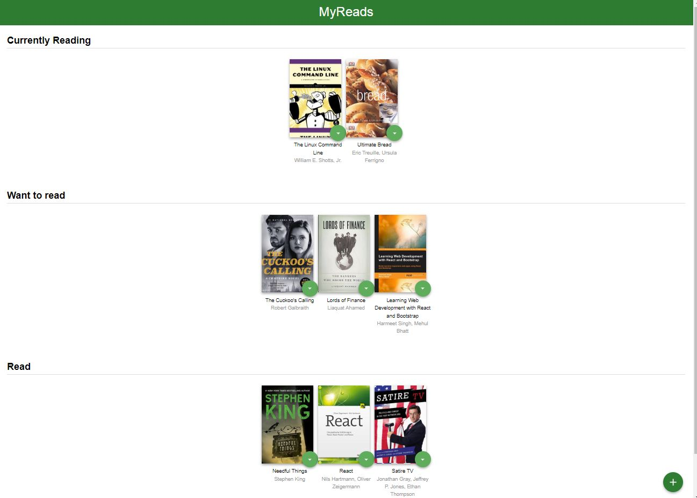
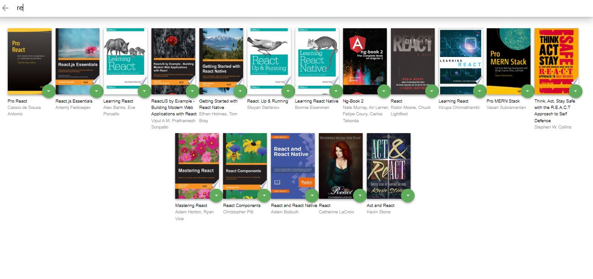

# MyReads Project

This project is about arranging my favourite books on three shelves :

- Currently reading
- Want to read
- Read

it offers also the possibility of searching for more books and adding them to my library.

## How it looks

It is composed of essentially of two pages:

- Home page :

- Search page :

## How to run it

To run the project :

- install all project dependencies with `npm install`
- start the development server with `npm start`

## Technologies Used :

React.js

## Credits

This project is one of the projects you can build when you enroll in the [React Nanodegree program in Udacity](https://www.udacity.com/course/react-nanodegree--nd019?utm_source=gsem_brand&utm_medium=ads_r&utm_campaign=12948014301_c_individuals&utm_term=127442638531&utm_keyword=react%20udacity_e&gclid=Cj0KCQjwhY-aBhCUARIsALNIC0477TNBiEiQgRpm3x42TxNq9Famw2jzeCbC5yejS_LoAoLjuMUuf0AaAhf7EALw_wcB) .
